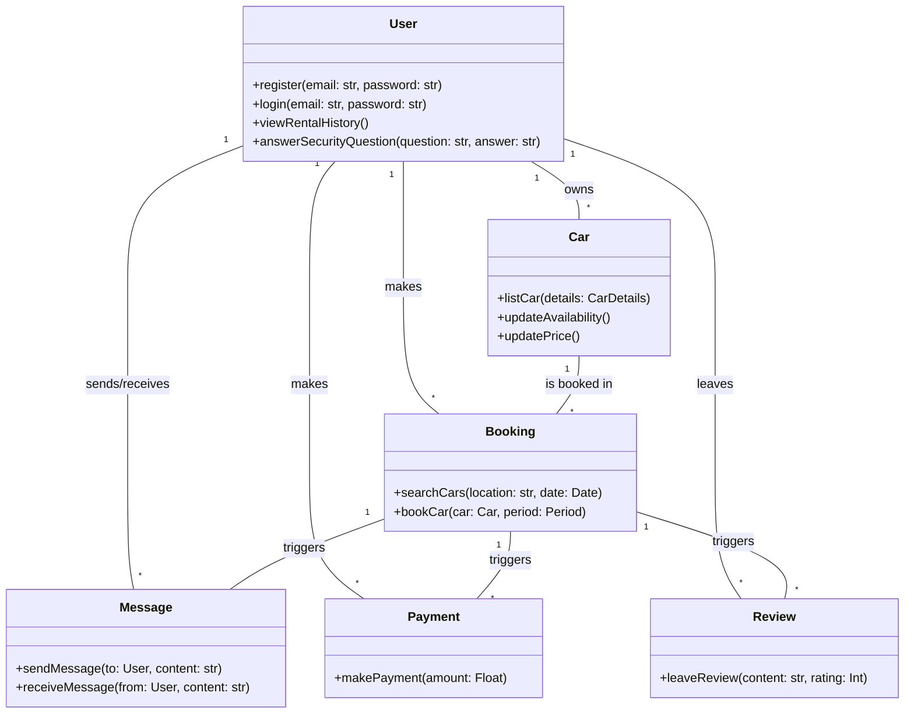

User is singleton with records entered to db through `register()`: ensure 
only a single instance of User with that email and password is available at
a time. Given the user has logged in, set a flag in db stating they have logged in.

TODO: revise this to be more accurate to system (I prefer coding to planning)