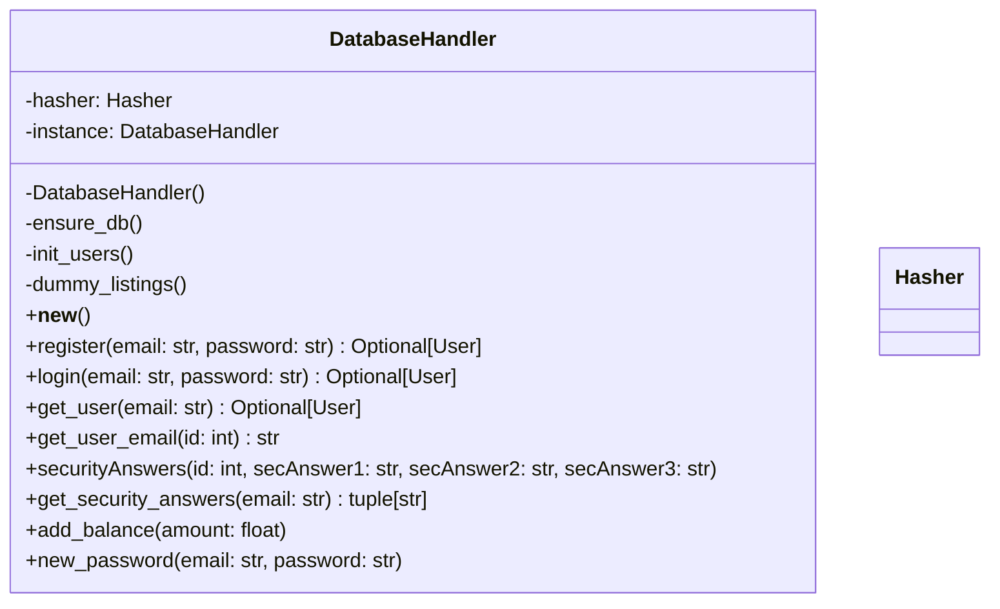
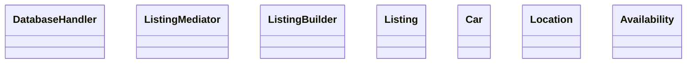
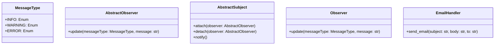

# Database Handler

We are using a main DatabaseHandler class to interface with our SQL database, with mediators handling specific operations.

# Users Handling
```mermaid
classDiagram
    class UserMediator {
        +db: DatabaseHandler
        +register(email: str, password: str) Optional[User]
        +login(email: str, password: str) Optional[User]
        +securityAnswers(id: int, secAnswer1: str, secAnswer2: str, secAnswer3: str)
        +get_security_answers(email: str)
        +new_password(email: str, password: str)
    }
    class User {
        +id: int
        +email: str
        +balance: float
    }
    
    SecurityQuestionHandler {

    }
    SecurityQuestion1Handler {

    }
    SecurityQuestion2Handler {
        
    }
    SecurityQuestion3Handler {
        
    }

```
   
# Listing Handling

   
# Observer


# Proxy
```mermaid
classDiagram
    Payment {

    }
    PaymentProxy {

    }