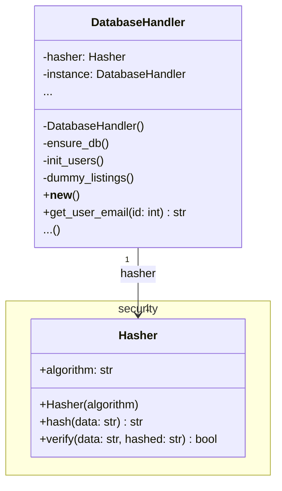
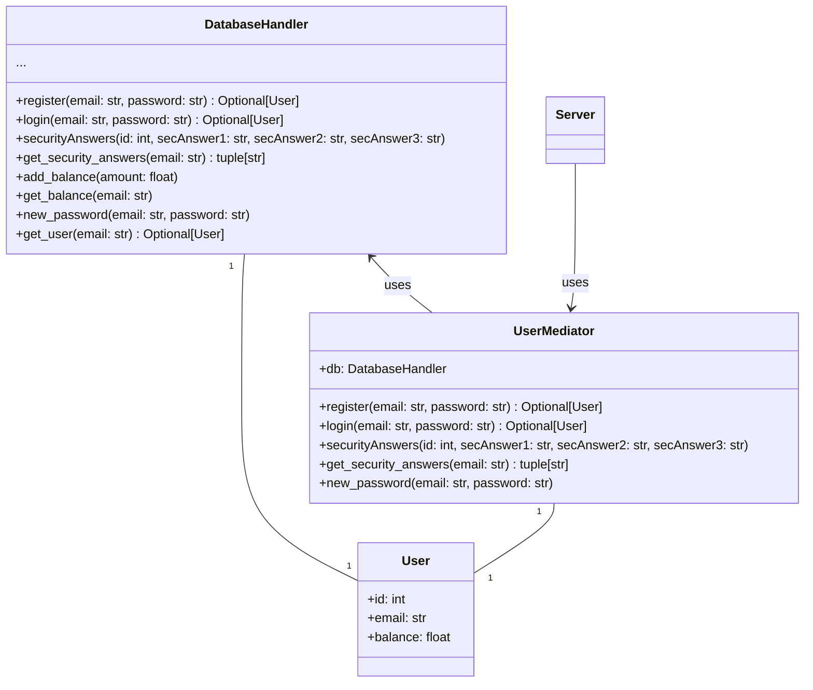
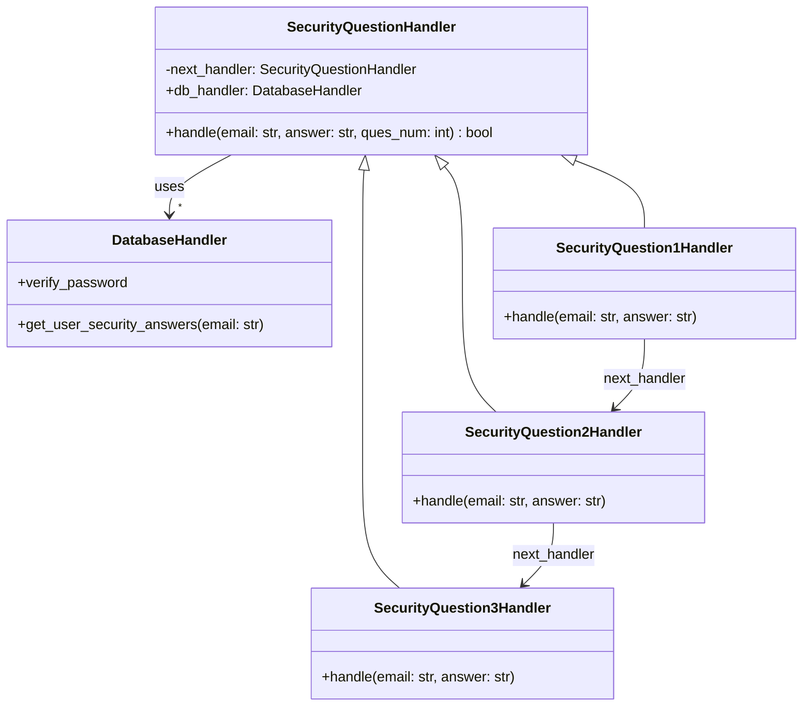
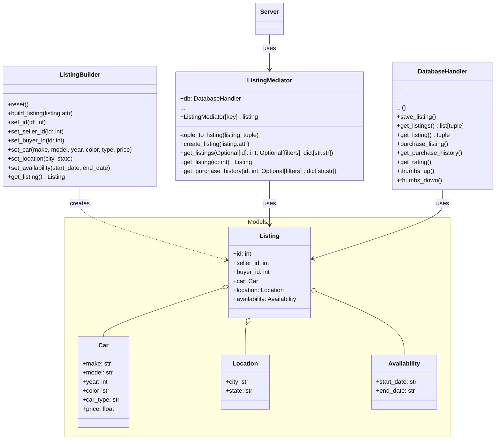
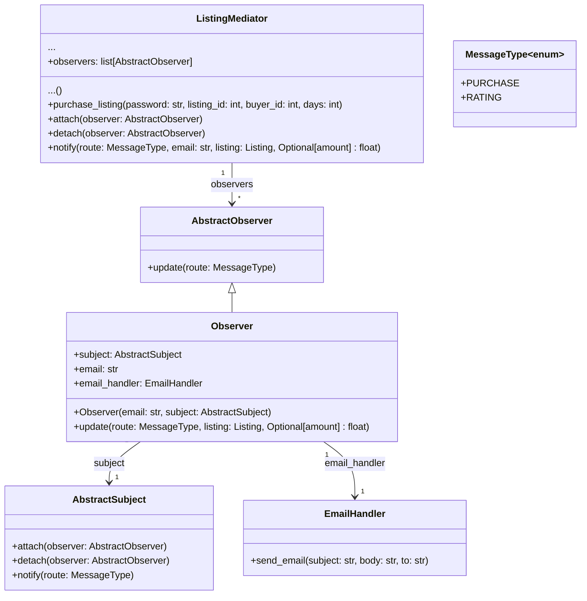
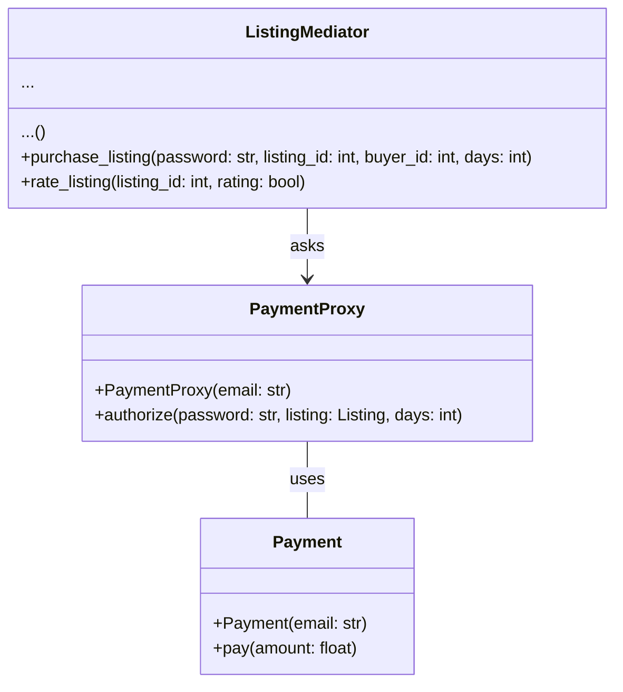

# Database Handler

We are using a main `DatabaseHandler` class to interface with our SQL database, with mediators handling specific operations.

# Users Handling

We use a mediator class between server and accesing user information from the database. This helps to divide the functions of the database's interface nicely. `User` objects are just used for storing the user data.

# Chain of Responsibility

The `SecurityQuestionHandler` class is a handler that can handle a request or pass it to the next handler in the chain (`next_handler`). The `SecurityQuestion1Handler`, `SecurityQuestion2Handler`, and `SecurityQuestion3Handler` classes are concrete handlers that handle the request or pass it along. The `DatabaseHandler` class is used by the handlers to get user security answers and verify password

# Listing Handling

   
# Observer

`Obeservers` are notified when a positive rating is recieved or a listing is purchased inside of the `ListingMediator`

# Proxy

The `ListingMediator` class interacts with the `PaymentProxy` class instead of interacting with the `Payment` class directly. The `PaymentProxy` class controls access to the Payment class, adding a layer of security. The `Payment` class just prints to the server and signifies the start to the payment process.
